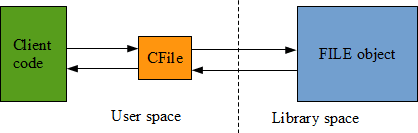
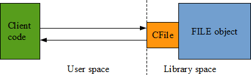
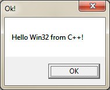
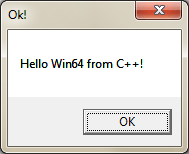

# Win32 revisited - Exposing a C++11 interface from a C library designed 30 years ago

## Introduction

Windows objects are abstractions used to manipulate various system resources. Their inner structure is hidden to the user via surrogate objects called handles which act as opaque identifiers from the client point of view. Implementation details for these objects are thus inaccessible, forcing the user to use the provided C interface[^1].

[^1]:Abstracting the memory address of the objects is not only a matter of good encapsulation but a necessity when these objects must be shared among several processes at the same time, each one having its own virtual memory space.

The present article aims at create an alternative interface that is not based on C functions and opaque handles but on C++ classes corresponding to the system objects. Such classes must be void of any implementation code, and be seen as imported from the system libraries. The goal is really to expose a new interface from an existing implementation without touching it!

In the first part we will focus on the technical aspects of that challenge, mostly dealing with low level C++ and system programming. In the second part, we will apply the resulting methodology to various system objects to see Win32 in a new light. Finally, we will try to extricate valuable lessons from that experiment.

> This article takes advantage of various C++11 features. As a result, Visual C++ 2013 or above is required to successfully compile the code. Note as well that the code presented is often simplified (no error management) to keep it concise.

## Part I - Technical principles

> The more the marbles wastes, the more the statue grows. (Michelangelo)

There are various ways and strategies when it comes to wrap some existing C code in C++. Often, it involves tracking some kind of unique identifier that must be given back to the C library:

```cpp
#include <stdio.h>

int main() {
    FILE *handle = fopen("test.txt", "w");
    fprintf(handle, "Hello World!");
    fclose(handle);
    return 0;
}
```

In the above example, we can identify that the `FILE` object has a constructor named `fopen`, a destructor named `fclose` and a member function named `fprintf`. Let's group them together in a C++ class.

```cpp
#include <cstdio>

class CFile {
public:
    CFile(const char * fileName,
          const char * fileMode) {
        m_handle = std::fopen(fileName, fileMode);
    }
    ~CFile() {
        std::fclose(m_handle);
    }
    void print(const char * text) {
        std::fprintf(m_handle, text);
    }
private:
    CFile(const CFile &) = delete; // non copyable
    CFile & operator=(const CFile &) = delete;

    FILE * m_handle;
};

int main() {
    CFile file("test.txt", "w");
    file.print("Hello World!");
}
```

This is a very classic way to wrap an existing code in C++. It is based on the <abbr title="Resource Acquisition Is Initialization">RAII</abbr> idiom and, as a side effect, the resulting class is designed to be directly manipulated (value semantic) instead of being indirectly accessed through a pointer (reference semantic).

It's a major change to the original C interface that it is worth mentioning[^2]. The CFile class is actually more acting like a proxy to the FILE object than a wrapper:

[^2]: Moreover, we had to make our class non copyable because the underlying FILE object is not copyable. This is somewhat in conflict with the introduced value semantic.



In such a design the C++ code is completely unknown and unrelated to the C library space. And this is not what we want to do in this article. Our goal is to expose a C++ interface from an existing C library without touching it:



It might sound unfeasible or at least very complicated since the library wasn't designed for that purpose. But it is actually quite simple: just remove the need of a C++ proxy instance. And that's what we are going to see right now.

### Removing the data layer

If we look again at the original C code:

```cpp
int main() {
    FILE * handle = fopen("test.txt", "w");
    fprintf(handle, "Hello World!");
    fclose(handle);
    return 0;
}
```

We might realize that the file handle is being used in a similar fashion than the hidden `this` pointer of a C++ class instance. Therefore, the following question might arise: what about casting the FILE pointer directly to a CFile object?

```cpp
class CFile {
public:
    static CFile * open(const char * fileName,
                        const char * fileMode) {
        return reinterpret_cast<CFile*>(
            std::fopen(fileName, fileMode));
    }
    void close() {
        std::fclose(reinterpret_cast<FILE*>(this));
    }
    void print(const char * text) {
        std::fprintf(reinterpret_cast<FILE*>(this), text);
    }
};

int main() {
    CFile * file = CFile::open("test.txt", "w");
    if (file) {
        file->print("Hello World!");
        file->close();
    }
}
```

It works, on both Windows and Linux. If we compare the compiled code of the C and C++ versions with optimizations turned on, it is strictly the same<note>The resulting exe is different because the second version embeds the code of the CFile class, but when optimizations are turned on, the assembly code generated for the main function is the same in both version.</note>. It is hence possible to have two distinct interfaces corresponding to the same binary implementation. Even if it's a side effect of compiler optimization, that's a good start!

The presence of `reinterpret_cast` tends to raise eyebrows, and that's for a good reason: it is often used to write illegal C++ code. In effect, addressing the same memory address from two different data types (other than [unsigned] char) at the same time is not guaranteed by the standard because of possible aliasing effects.

However, in our case, we do not try to dereference the casted pointer. It was created only for syntactic purpose, and is casted back to the correct type each time it is needed. Therefore, this use of `reinterpret_cast` is perfectly valid and harmless.

Anyway, that's just temporary code as we will see later how to get rid of all casts. But before that, let's see how we can apply the same trick on Win32 handles.

### Hacking Win32 handles

```cpp
#define WIN32_LEAN_AND_MEAN
#include <windows.h>

class Module {
public:
    static Module * Load(const char * fileName) {
        return reinterpret_cast<Module*>(
            ::LoadLibraryA(fileName));
    }
    bool Free() {
        return ::FreeLibrary(
            reinterpret_cast<HMODULE>(this)) == TRUE;
    }
    template<typename T>
    T GetProcAddress(const char * procName) {
        return (T) ::GetProcAddress(
                   reinterpret_cast<HMODULE>(this),
                   procName);
    }
};

// pointer to the MessageBox (ANSI) function
typedef int (WINAPI * MsgBox)(
    HWND hWnd, LPCSTR lpText, LPCSTR lpCaption, UINT uType);

#ifdef _WIN64
    const char * message = "Hello Win64 from C++!";
#else
    const char * message = "Hello Win32 from C++!";
#endif

int main() {
    Module * lib = Module::Load("user32.dll");
    if (lib) {
        auto fn = lib->GetProcAddress<MsgBox>("MessageBoxA");
        if (fn) {
            fn(nullptr, message, "Ok!", MB_OK);
        }
        lib->Free();
    }
}
```

It can be tested from the VS2013 x86 command prompt:

`cl.exe /MD hacking_handles.cpp /Fehacking_handles-x86.exe`



And from the VS2013 x64 command prompt:

`cl.exe /MD hacking_handles.cpp /Fehacking_handles-x64.exe`



As shown above, the `this` pointer has been successfully mapped on the `HMODULE` handle. That's because on both Win32 and Win64, handle types are defined as opaque pointers, making their size equal to the size of a pointer. This is the first requirement of that trick[^3].

[^3]: Actually, the size of the handle type could be less than the size of a pointer depending on how the calling convention promotes types.

The second requirement is to never dereference the `this` pointer. For that reason our classes must always be completely empty, which means of course no data member, but also no virtual feature (to avoid the virtual table pointer).

### Adjusting the object model

Instances of such classes can be neither instantiated nor destroyed directly by the user: they belong to Win32, and as a result they do not follow the default C++ object model. To reflect that important point in our design, we will use the following WinObject class as a common base for our future class hierarchy.

```cpp
class WinObject {
private:
    WinObject() = delete;
    ~WinObject() = delete;
    WinObject(const WinObject &) = delete;
    WinObject & operator=(const WinObject &) = delete;
};
```

The default constructor and the destructor are private and even marked as deleted (C++11 feature) to reflect the fact we don't have access to them (they are not exposed by Win32). We also forbid object copy to strengthen the reference semantic of theses objects.

As a result WinObject would normally become sealed: it would be impossible to instantiate a child class. But in our case, we will manipulate plenty of valid children instances. It's as if it was sealed for the users but not for the package it belongs to!

But what about inheritance? An object size can't be zero even if it's an empty class. Therefore there is a risk to alter the layout of the children classes which then would make the compiler adjust the `this` pointer accordingly. In other words: it would invalidate our trick!

```cpp
class A : public WinObject {
};
class B : public A {
};

// should always succeed
static_assert(sizeof(WinObject) == 1, "Not empty!");

// susceptible to fail!
static_assert(sizeof(A) == 1, "Not empty!");
static_assert(sizeof(B) == 1, "Not empty!");
```

It appears to work fine thanks to the Empty Base Optimization[^4]. Such an optimization is possible because the standard says the base class sub-object *may* have zero size (1.8/5)... or may not!

[^4]: VC++ supports EBO since many years. It is known to have been restricted to single inheritance but even though that's fine for us.

In other terms we are in the implementation defined gray zone. But since we target quite modern compilers (C++11) that's a reasonable lelvel of risk. And the `static_assert` is here to detect any problem.

### Removing the C headers dependency

> Starting from now, the code will be specific to Win32 (x86). The support of Win64 (x64) will be reintroduced later.

To move closer to a pure C++ interface, we need to get rid of the Win32 C headers. We are now going to clearly separate the interface from its implementation in such a way it does not depend on Win32 types.

```cpp
#include <cstdint>
#include "winobject.h"

namespace winapi {

enum class LoadingFlags : std::uint32_t {
    DONT_RESOLVE_DLL_REFERENCES         = 0x00000001,
    LOAD_LIBRARY_AS_DATAFILE            = 0x00000002,
    LOAD_WITH_ALTERED_SEARCH_PATH       = 0x00000008,
    // more flags...
    LOAD_LIBRARY_SEARCH_SYSTEM32        = 0x00000800,
    LOAD_LIBRARY_SEARCH_DEFAULT_DIRS    = 0x00001000,
};

// Loading flags can be combined together so we provide
// an OR operator for that purpose
// (can't use constexpr as it's not supported by VC++ 2013)
inline LoadingFlags
operator|(LoadingFlags left, LoadingFlags right) {
    return static_cast<LoadingFlags>(
        static_cast<std::uint32_t>(left) |
        static_cast<std::uint32_t>(right));

class Module : public WinObject {
public:
    // LoadLibraryA
    static Module * __stdcall Load(const char * fileName);
    // LoadLibraryExW
    static Module * __stdcall Load(const wchar_t * fileName,
        std::nullptr_t, LoadingFlags flags);
    // FreeLibrary
    bool __stdcall Free();
    // GetProcAddress
    void* __stdcall GetProcAddress(const char * procName);
};

static_assert(sizeof(Module) == 1, "Not empty!");
}
```

Common Win32 types such as `UINT` can be easily replaced by standard C++ types, including `BOOL` that can be safely substituted by `bool` since `true` and `false` are guaranted to be 1 and 0 by the standard (4.5/4 and 4.7/4).

Note the use of the `winapi` namespace, of function overloading for `Module::Load`, and of `std::nullptr_t` to force the caller to pass `nullptr` (as required by the documentation of `LoadLibraryEx`).

The preprocessor constants expected by `LoadLibraryEx` have been grouped together in a strongly typed enum. This C++11 feature is very convenient to control the underlying type of the enum, but the fact it is strongly typed forbids the values to be combined together as it is normally possible here (it's not always the case). A specific `operator|` had to be added for that purpose.

You may wonder he reason why we introduced the `__stdcall` calling convention. That's what we are going to see right now.

### Removing the C++ overhead

One of the most tedious things when writing a wrapper is to declare plenty of functions that do not much more than forwarding their call to the underlying library. It's particularly true in our case since we don't intend to wrap the C functions but to directly call them from C++.

We can greatly reduce the amount of work needed by combining some compiler extension with a pinch of assembly:

```cpp
#include "module.h"

#define WIN32_LEAN_AND_MEAN
#include <windows.h>

namespace winapi {

__declspec(naked) Module * __stdcall
Module::Load(const char *) {
    __asm jmp LoadLibraryA
}
__declspec(naked) Module * __stdcall
Module::Load(const wchar_t *, std::nullptr_t, LoadingFlags) {
    __asm jmp LoadLibraryExW
}
__declspec(naked) bool __stdcall
Module::Free() {
    __asm jmp FreeLibrary
}
// handle name collision with Win32
static auto Win32GetProcAddress = &::GetProcAddress;
__declspec(naked) void * __stdcall
Module::GetProcAddress(const char *) {
    __asm jmp dword ptr [Win32GetProcAddress]
}

}
```

The `__declspec(naked)` is a VC++ specific extension that tells the compiler not to generate prologue and epilogue for the function. The given stack frame is therefore not modified by C++ and it can be directly forwarded to the Win32 function. No more need to push again on the stack the given parameters, neither do we need their names! However we still need to include *windows.h* in the implementation file in order to get the name of the Win32 functions to jump to.

As you may noticed, we had to declare a global variable `Win32GetProcAddress` to manage the name clash between Win32 and our library. Without that, the `GetProcAddress` member function would jump on itself, creating an infinite loop. The final result works well with Win32 but can't be used with Win64<note>The x64 compiler does not support inline assembly.</note>.

Of course, to work properly, our C++ function prototype must be compatible with the Win32 function being jumped to: same number of arguments, in the same order, same calling convention (`__stdcall`).

If you are familliar with the <abbr title="Portable Executable">PE</abbr> format this trampoline technique should remind you how function import works. In short, for each imported function, the linker creates an entry in a place called the Import Address Table where the actual address of the function in memory is written / updated at runtime<note>Typically by the system loader of Windows.</note>. This IAT entry is in fact a simple pointer to a function living in another module (DLL).

Now, a function pointer is a data, and you don't call a data: you call the function pointed by this data. So our direct call to `LoadLibraryA` should be nonsense:

`call LoadLibraryA`

but it does work fine. That's because the linker generated an additional stub that looks like this:

```
LoadLibraryA:
    jmp dword ptr [__imp__LoadLibraryA@8]
```

where `__imp__LoadLibraryA@8` is the symbol name for the function pointer in the IAT. Therefore `LoadLibraryA` is not the real function living in kernel32.dll but a local function specific to our module<note>This stub is not generated when our own module importing `LoadLibraryA` is being built but when the module that exports the function (kernel32.dll) was created. It was then placed with other similar stubs in the resulting import library file (kernel32.lib).</note>! As a result, we have our own generated trampoline jumping to another trampoline generated by the linker. Let's fix that now.

```cpp
__declspec(naked) Module * __stdcall
Module::Load(const char *, std::nullptr_t, LoadingFlags) {
    __asm jmp dword ptr [__imp__LoadLibraryA@8]
}
__declspec(naked) Module * __stdcall
Module::Load(const wchar_t *, std::nullptr_t, LoadingFlags) {
    __asm jmp dword ptr [__imp__LoadLibraryExW@8]
}
__declspec(naked) bool __stdcall
Module::Free() {
    __asm jmp dword ptr [__imp__FreeLibrary@4]
}
__declspec(naked) bool __stdcall
Module::GetProcAddress(const char *) {
    __asm jmp dword ptr [__imp__GetProcAddress@8]
}
```

The overhead of our interface is now being reduced to a single jump instruction. In term of runtime overhead, we won't do better. But we can still go further by letting the linker generate the trampoline stub, allowing us to completely remove the implementation code!

> This is the final stage of our technical exploration, and the proposed solution works on both x86 and x64 platforms.

### Removing the implementation code

To get rid of the implementation code, we are going to take advantage of a specific feature of the PE format: export forwarding. It is indeed possible to forward the implementation of an exported function to another DLL. You can see this feature as an aliasing mechanism where one DLL can propose an alternative name for a function exported by another. And that's exactly what we need to create a second interface to Win32!

There are several ways to instruct the linker to create forwarded exports. It can be done via a specific pragma<note>#pragma comment(linker, "/export:<alias>=<function>")</note>, directly from the command line, or via a definition file. We will use the .def file so we can remove the .cpp file.

The general syntax is as follows:

```
EXPORTS
    <alias>=<function>
```
    
where *alias* is the name of our C++ alias and *function* the name of the already existing function. Since the forwarding mechanism jumps from the export table to the import table of the module, it is not possible to create an alias of an exported function living in the same module: *function* must reference a function exported by another module.

```
; Win32/x86 implementation
EXPORTS
?Load@Module@winapi@@SGPAV12@PBD@Z=_LoadLibraryA@4
?Free@Module@winapi@@QAG_NXZ=_FreeLibrary@4
?GetProcAddress@Module@winapi@@QAGPAXPBD@Z=_GetProcAddress@8
```

The tricky part is to get the mangled names of the symbols:

* for the C++ symbols: just build some testing code that references it and extract the mangled name from the resulting link error messages
* for the Win32 functions: the mangling scheme used is fairly simple: an underscore is prepended to the function name, and an at sign is appended followed by the total size in bytes of the expected parameters
* for the Win64 functions: names are not decorated!

```
; Win64/x64 implementation
EXPORTS
?Load@Module@winapi@@SAPEAV12@PEBD@Z=LoadLibraryA
?Free@Module@winapi@@QEAA_NXZ=FreeLibrary
?GetProcAddress@Module@winapi@@QEAAPEAXPEBD@Z=GetProcAddress
```

It's time to “build” the final result. From the x86 command prompt:

```
link /DLL /MACHINE:X86 /DEF:module-x86.def /OUT:win32cpp.dll
/NOENTRY kernel32.lib /NOLOGO
```

The `/NOENTRY` option creates a resource-only DLL, making it void of any executable code. The resulting file size is 2.5 Ko!

If we supply the `/DEBUG` option, we can afterwards verify that all its exports are forwarded:

```
link /dump /exports win32cpp.dll /NOLOGO

ordinal hint RVA      name
  1  0 00001000 ?Free@Module@winapi@@QAG_NXZ = _FreeLibrary@4
  2  1 00001006 ?GetProcAddress@Module@winapi@@QAGPAXPBD@Z =
_GetProcAddress@8
  3  2 0000100C ?Load@Module@winapi@@SGPAV12@PBD@Z =
_LoadLibraryA@4
```
